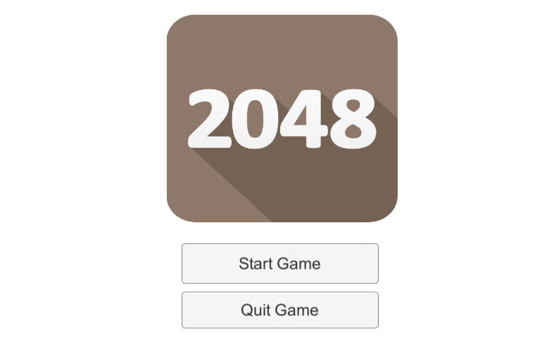
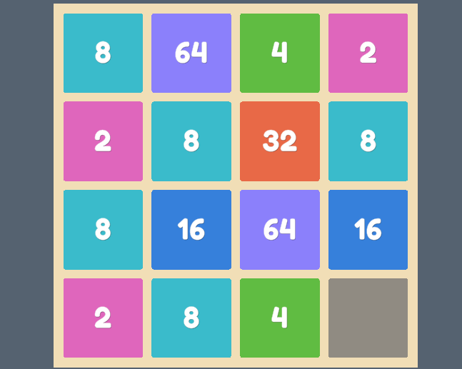
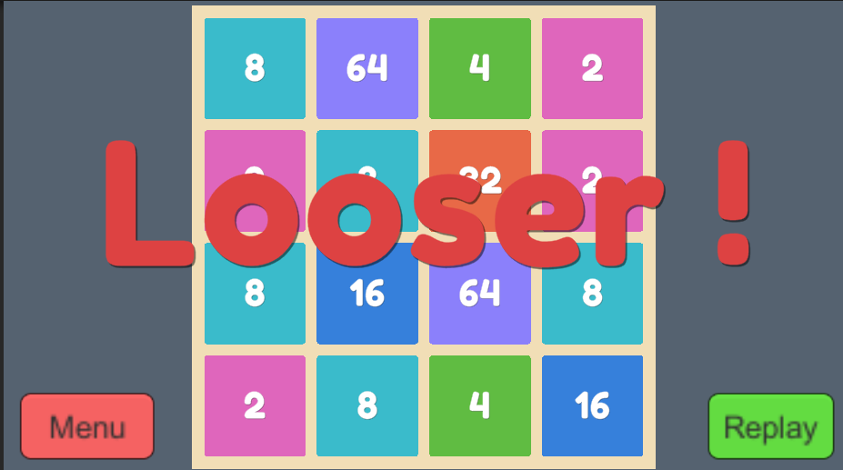

# Project_2048
 

 A Unity game made about the famous 2048 application.

 ## Gameplay
    The player have to swipe the tiles left,right,up and lastely down to add the same value digits to harvest the largest value tile  without using all the board space. 

 ## Demo
 The starting UI :

 

The Gameplay :

And lastely, the GameOver XD :

